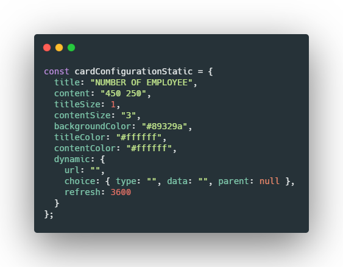
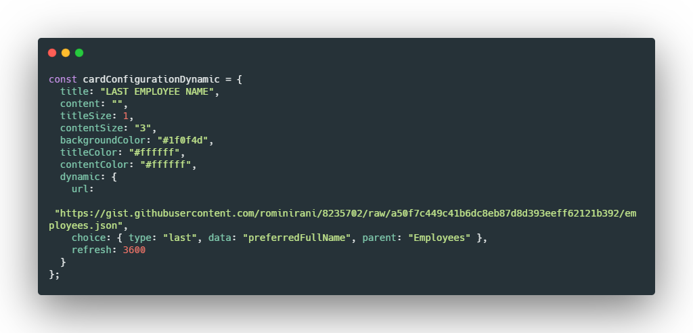
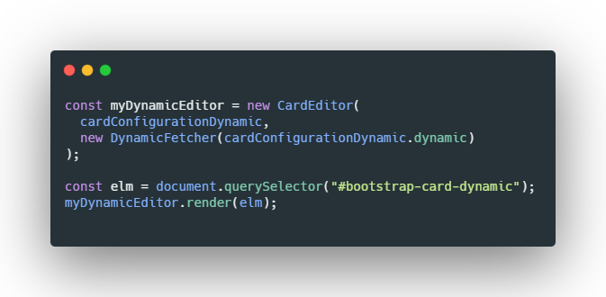

<!--
*** Thanks for checking out the Best-README-Template. If you have a suggestion
*** that would make this better, please fork the repo and create a pull request
*** or simply open an issue with the tag "enhancement".
*** Thanks again! Now go create something AMAZING! :D
-->

<!-- PROJECT LOGO -->
<br />
<p align="center">
  <h3 align="center">BOOTSTRAP CARD EDITOR</h3>

  <p align="center">
    An awesome Bootstrap Card Editor for your dashboard or other usage !
    <br />
    <a href="https://github.com/jeremyrncp/bootstrap-card-editor#documentation"><strong>Explore the docs »</strong></a>
    <br />
    <br />
    <a href="https://github.com/jeremyrncp/bootstrap-card-editor">View Demo</a>
    ·
    <a href="https://github.com/jeremyrncp/bootstrap-card-editor/issues">Report Bug</a>
    ·
    <a href="https://github.com/jeremyrncp/bootstrap-card-editor/issues">Request Feature</a>
  </p>
</p>

<!-- TABLE OF CONTENTS -->
<details open="open">
  <summary>Table of Contents</summary>
  <ol>
    <li>
      <a href="#about-the-project">About & Usage</a>
      <ul>
        <li><a href="#built-with">Built With</a></li>
      </ul>
    </li>
    <li>
      <a href="#getting-started">Getting Started</a>
      <ul>
        <li><a href="#prerequisites">Prerequisites</a></li>
        <li><a href="#installation">Installation</a></li>
      </ul>
    </li>
    <li><a href="#documentation">Documentation</a></li>
    <li><a href="#roadmap">Roadmap</a></li>
    <li><a href="#contributing">Contributing</a></li>
    <li><a href="#license">License</a></li>
    <li><a href="#contact">Contact</a></li>
    <li><a href="#acknowledgements">Acknowledgements</a></li>
  </ol>
</details>

<!-- ABOUT THE PROJECT -->

## About & Usage

**Bootstrap Card Editor** is a simple card editor and render for business intelligence dashboard or other usage.

You have possibility to integrate editor in DOM element or use modal editor

With **Bootstrap Card Editor** you configure a static card or dynamic card with JSON integration.

**Bootstrap Card Editor** provide two editors :

- inline editor
- modal editor

After configuration, Bootstrap Card Editor dispatch an event **cardEditorConfigure** with a ful configuration for implementation.

Example :



Or dynamic example, a configuration for **DynamicFetcher**, a very simple ETL for JSON.



With this configuration, render card is very simple :




A list of commonly used resources that I find helpful are listed in the acknowledgements.

### Built With

- [Bootstrap](https://getbootstrap.com)
- [JQuery](https://jquery.com)
- [Mustache](https://mustache.github.io/)

<!-- GETTING STARTED -->

## Getting Started

### Prerequisites

- npm
  ```sh
  npm install npm@latest -g
  ```

### Installation

1. Clone the repo
   ```sh
   git clone https://github.com/jeremyrncp/bootstrap-card-editor.git
   ```
2. Install NPM packages
   ```sh
   npm install
   ```
3. Install NPM packages
   ```sh
   npm run build
   ```

   **or**

 1. Install NPM packages
   ```sh
   npm install bootstrap-card-editor
   ```  

<!-- DOCUMENTATION -->

## Documentation

## CardEditor

    import  {  CardEditor  }  from  "./card-editor.js";

### `modalEditor()`

Render editor in modal

- **Example:** \* // Render editor in modal
  const cardEditor = new CardEditor()
  cardEditor.modalEditor()
- **Returns:** `void` —

### `inlineEditor(elm)`

Render editor in element

- **Parameters:** `elm` — `*` — : a valid element
- **Example:** \* // Render editor in element
  const cardEditor = new CardEditor()
  const elm = document.querySelector("div")
  cardEditor.inlineEditor(elm)
- **Returns:** `void` —

### `getConf()`

Get render editor configuration

- **Returns:** `object` — configuration of CardEditor

### `render(elm)`

Render card in element with card editor configuration

- **Example:** \* // Render editor in element
  const cardEditor = new CardEditor()
  const elm = document.querySelector("div")
  cardEditor.inlineEditor(elm)
    <p>
    elm.addEventListener("cardEditorConfigure", (event) => {
    const elementToRendered = document.querySelector("#element")
    const newCardEditor = new CardEditor(event.detail)
    newCardEditor.render(elm)
    })
- **Parameters:** `elm` — `*` — : a valid element

## DynamicFetcher

    import  {  DynamicFetcher  }  from  "./dynamic-fetcher";

### `renderEditor(elm)`

Render editor in element

- **Parameters:** `elm` — `*` — : a valid element
- **Example:** \* // Render to div
  const div = document.querySelector("div")
  const dynamicFetcher = new DynamicFetcher()
  dynamicFetcher.render(div);
- **Returns:** `void` —

### `renderResult(elm, conf = null)`

Render result in element with configuration, render is refreshed

- **Parameters:**
  - `elm` — `*` — : a valid element
  - `conf` — `*` — : a valid configuration or null
- **Example:** \* // Render to div
  const div = document.querySelector("div")
  const dynamicFetcher = new DynamicFetcher()
  dynamicFetcher.renderResult(div, {url:"https://gist.githubusercontent.com/rominirani/8235702/raw/a50f7c449c41b6dc8eb87d8d393eeff62121b392/employees.json", choice: { type: "last", data: "preferredFullName", parent: "Employees" }, refresh: 3600});
- **Returns:** `void` —

<!-- ROADMAP -->

## Roadmap

See the [open issues](https://github.com/jeremyrncp/bootstrap-card-editor/issues) for a list of proposed features (and known issues).

<!-- CONTRIBUTING -->

## Contributing

Contributions are what make the open source community such an amazing place to be learn, inspire, and create. Any contributions you make are **greatly appreciated**.

1. Fork the Project
2. Create your Feature Branch (`git checkout -b feature/AmazingFeature`)
3. Commit your Changes (`git commit -m 'Add some AmazingFeature'`)
4. Push to the Branch (`git push origin feature/AmazingFeature`)
5. Open a Pull Request

<!-- LICENSE -->

## License

Distributed under the MIT License. See `LICENSE` for more information.

<!-- CONTACT -->

## Contact

Jérémy Gaultier - contact@gaultierweb.com

Project Link: [https://github.com/jeremyrncp/bootstrap-card-editor](https://github.com/jeremyrncp/bootstrap-card-edito)
